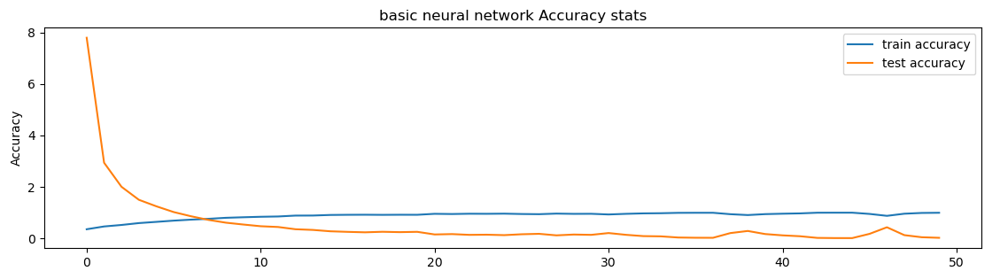
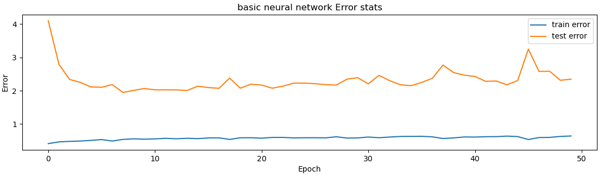

# Music genre classification

## Libraries used
- [math](https://docs.python.org/3/library/math.html)
- [os](https://docs.python.org/3/library/os.html)
- [librosa](https://pypi.org/project/librosa/)
- [json](https://docs.python.org/3/library/json.html)
- [numpy](https://pypi.org/project/numpy/)
- [tensorflow](https://www.tensorflow.org/install/pip)
- [contextlib](https://docs.python.org/3/library/contextlib.html)
- [sklearn](https://pypi.org/project/scikit-learn/)
## About Dataset

#### GTZAN dataset
The GTZAN dataset is the most-used public dataset for evaluation in machine listening research for music genre recognition (MGR).
The files were collected in 2000-2001 from a variety of sources including personal CDs, radio, microphone recordings, in order to represent a variety of recording conditions.
30 seconds audio files are arranged in folders sorted by genres.

#### First Publication with this dataset
G. Tzanetakis and P. Cook, "Musical genre classification of audio signals," in IEEE Transactions on Speech and Audio Processing, vol. 10, no. 5, pp. 293-302, July 2002, doi: 10.1109/TSA.2002.800560.

[publication](https://ieeexplore.ieee.org/document/1021072)

[Dataset link ](https://www.kaggle.com/andradaolteanu/gtzan-dataset-music-genre-classification)

##### Caveat

Latest numpy, numpy v1.24.0 has issues with librosa library
Degrade to version <=1.20.0

## Results
### Basic neural network

